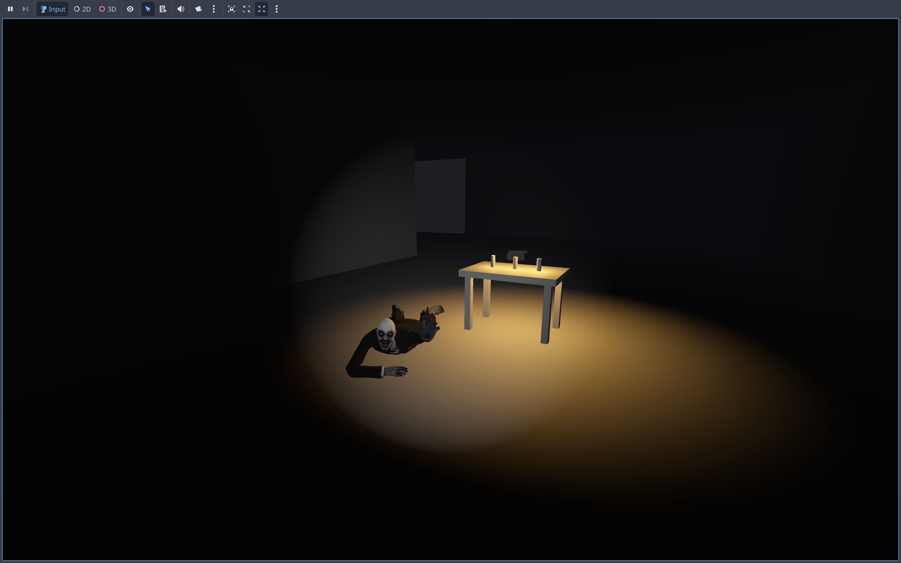

# Horror Game

A first-person survival horror game built with Godot Engine 4.5. Navigate through a dark mansion while being hunted by a crawling zombie named George. Manage your flashlight battery, find hiding spots, and survive as long as you can!



## 🎮 Game Overview

You play as a character trapped in a dark mansion with a zombie crawling after you. Your only source of light is a flashlight with limited battery life. Collect batteries to keep your light on, but beware - each battery you collect makes George faster!

## 🎯 Gameplay Features

### Player Mechanics
- **First-Person Movement**: WASD controls with mouse look
- **Flashlight System**: Toggle with `F` key - your only source of light
- **Battery Management**: Flashlight drains over 2 minutes - collect batteries to recharge
- **Sprint System**: Hold `Shift` to sprint, but watch your stamina
- **Head Bob**: Realistic head movement while walking for immersion
- **Interactive Doors**: Press `E` near doors to open/close them
- **Hiding Spots**: Enter designated zones to hide from the zombie

### Enemy AI
- **George the Zombie**: A crawling zombie that relentlessly pursues you
- **Dynamic Difficulty**: Each battery pickup makes George faster
- **Navigation**: Uses Godot's NavigationAgent3D for pathfinding
- **Attack Range**: Gets you when within 2 meters

### Atmosphere
- **Ambient Sound System**: Background drone, wind sounds, and random creaks
- **Dynamic Lighting**: Flashlight dims and flickers as battery drains
- **Fog Effects**: Volumetric fog for atmospheric horror
- **Jumpscare Death**: Dramatic death sequence when caught

## ⌨️ Controls

| Action | Key |
|--------|-----|
| Move Forward | `W` |
| Move Backward | `S` |
| Move Left | `A` |
| Move Right | `D` |
| Sprint | `Shift` (hold) |
| Jump | `Space` |
| Flashlight Toggle | `F` |
| Interact (Door/Battery) | `E` |
| Mouse Look | Mouse Movement |
| Release Mouse | `ESC` |

## 🛠️ Requirements

- **Godot Engine**: Version 4.5 or later
- **Rendering**: Forward Plus renderer
- **Platform**: Windows, macOS, or Linux

## 📁 Project Structure

```
Horror Game/
├── addons/
│   └── gdai-mcp-plugin-godot/    # AI MCP plugin for Godot
├── audio/                         # Background music and sound effects
├── characters/                    # Zombie model and textures
├── scenes/                        # Game scenes (mansion.tscn)
├── ambience_manager.gd           # Ambient sound system
├── battery.gd                     # Battery pickup logic
├── crawling_zombie.gd            # Zombie enemy AI
├── enemy.gd                      # Base enemy class
├── hide_zone.gd                   # Hiding spot detection
├── interactive_door.gd           # Door interaction system
├── player.gd                      # Main player controller
├── zombie_chase.gd               # Zombie chase behavior
├── project.godot                  # Godot project settings
└── main.tscn                     # Main scene entry point
```

## 🚀 Getting Started

1. **Clone the repository:**
   ```bash
   git clone https://github.com/natea/horrorgame.git
   cd horrorgame
   ```

2. **Open in Godot:**
   - Launch Godot Engine 4.5+
   - Click "Import" and select the `project.godot` file
   - Click "Import & Edit"

3. **Run the game:**
   - Press `F5` or click the "Play" button
   - The main scene (`scenes/mansion.tscn`) will load automatically

## 🎨 Game Mechanics Explained

### Battery System
- Flashlight starts at 100% battery
- Drains at a rate of 100% per 120 seconds (2 minutes)
- Below 30% battery, the light begins to flicker
- Collect batteries (press `E` when nearby) to restore 50% battery
- **Warning**: Each battery collected increases George's speed by 0.1 units!

### Stamina System
- Maximum stamina: 100%
- Sprinting drains stamina at 20% per second
- Regenerates at 15% per second when not sprinting
- If stamina reaches 0%, you become exhausted and cannot sprint
- Sprinting is re-enabled when stamina reaches 30%

### Hiding System
- Enter designated hide zones to become invisible to the zombie
- The zombie will stop chasing when you're hiding
- Exit the hide zone to become visible again

### Death System
- When caught by George (within 2 meters), a jumpscare sequence triggers
- The zombie appears in front of you with dramatic lighting
- A jumpscare image and "YOU DIED" message appear
- The scene automatically restarts after 3 seconds

## 🔧 Technical Details

### Rendering
- Uses Forward Plus rendering pipeline
- Volumetric fog for atmosphere
- Dynamic flashlight with energy-based lighting
- Low ambient light (0.1 energy) for horror atmosphere

### Audio
- Background ambient drone (non-positional)
- Wind sounds
- Random positional creaks throughout the environment
- Procedurally generated jumpscare sound on death

### Navigation
- Zombie uses NavigationAgent3D for pathfinding
- Chases player within 50-meter range
- Stops and attacks when within 2 meters

## 🐛 Known Issues / Notes

- If you encounter HTTP 400 errors when pushing to GitHub with Screen Time enabled, see `SCREENTIME.md` for a workaround.

## 📝 License

This project is open source. See individual asset licenses for audio and model files.

## 🤝 Contributing

Contributions are welcome! Feel free to submit issues or pull requests.

## 🎮 Credits

- Built with [Godot Engine](https://godotengine.org/)
- Audio assets from various sources (see audio folder)
- Zombie model: "Zombie Crawl" animation set

---

**Survive if you can!** 👻

